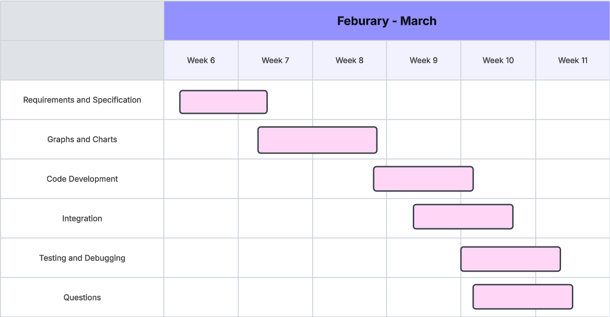

# <ins> **Yr11 Assessment Task 1 (2025)** <ins>
##### **By Chris Wong**
-----
### <ins> **Requirement Definition** <ins>
The code enables the users to find information on pokemon abilities, types and much more. It can also find the highest health, weight or agility of a pokemon and all this is completed through the systems code and api.

---
### <ins> **Functional Requirements** <ins>
**Data Retrieval: What does the user need to be able to view in the system?**\
The user will need to download the required datapacks for the code.

**User Interface: What is required for the user to interact with the system?**\
The user will need to be able to open up terminal and type in required functions into it.

**Data Display: What information does the user need to obtain from the system?**\
The user obtains information on pokemon types, abilities, sound and stas from the system

---
### <ins> **Non-Functional Requirements** <ins>
**Data Retrieval: What does the user need to be able to view in the system?**\
The user will need to view the termanal that allows them to find out what they want to know in the system

**Reliability: How reliable does the system and data need to be?**\
The system needs to be relaiable and up to date

**Usability and Accessibility: How easy to navigate does the system need to be? What instructions will we need for users to access the system?**\
We need instructions for the commands that will need to be inputed into the terminal

---
## <ins> **Determining Specifications** <ins>
### <ins> **Functional Specifications** <ins>
#### <ins> User Requirements <ins>

- What does the user need to be able to do? List all specifications here.
    - The user will need to be literate and know how to type. They will also have to know about pokemon names so they can use the system.

#### <ins> Inputs & Outputs <ins>

- What inputs will the system need to accept and what outputs will it need to display?
    - The system will accept the given the commands and it will output what the command ask it to do

#### <ins> Core Features <ins>

- At its core, what specifically does the program need to be able to do?
    - The program has to return what the user command is unless it is something that is not included in program

#### <ins> User Interaction <ins>

- How will users interact with the system (e.g. command-line, GUI?) and what information will it need to provide to help users navigate?
    - The user uses the terminal(command line) 
#### <ins> Error Handling <ins>

- What possible errors could you face that need to be handled by the system?
    - Errors that can be faced is if the user captalise or doesnt capitalise some words in the command 
---
### <ins> **Non-Functional Specifications** <ins>
- What would improve the system but is ultimately not required?
    - Ways to improve the system is making 

#### <ins> Performance <ins>

- How quickly should we try to get the system to perform tasks, what efficiency is required to maintain user engagement? How can we ensure our program remains efficient?
    - We should try to get the system to peform the task as soon as the user types the command

#### <ins> Useability / Accessibility <ins>

- How might you make your application more accessible? What could you do with the User Interface to improve usability?
    - The layout of the could be more easy to read so that people can use it better

####  <ins> Reliability <ins>

- What could perhaps not crash the whole system, but could be an issue and needs to be addressed? Data integrity? Duplicate data? API retrieval crash?
    - Problams that could occur includes the user typing in the wrong name and it could be fixed by giving suggestions of names that are similiar to what the user has typed.
---
## **Use Cases**
Actor: User (Pokemon Fanatic)\
Preconditions: API avaliable, Installed requirements\
Main Flow:
1. **User Choice**: User enters 1, 2, 3, 4 or 5 to decide what way do they want the info to be or end the program
2. **Pokemon Choice**: User chooses what pokemon they want to see and system collects data and stores pokemon nameinto history
3. **Search Pokemon By Stat**: User chooses what stat they and to see, how many pokemon and from highest or from lowest stat, system collects and shows data
4. **View Search History**: User gets all pokemon they have searched before.
5. **Delete Search History**: System Deletes file if user chooses to.

Postconditions: Retrieval of pokemon data, pokemon, history and the removal of history is succcessful.

---
# <ins> **Development** <ins>
---
### Gnatt Chart

---
### Structure Chart

---
### Flow Chart: main()
 Flowchart.png>)
### Pseudocode

BEGIN main():    

    choice = 5
    WHILE choice is not 5
        DISPLAY menu options
        INPUT choice

        IF choice is 1 THEN
            GET Pokemon name
            IF Pokemon exists:
                FETCH and DISPLAY Pokemon data
                SAVE to search history
            ELSE:
                SUGGEST similar Pokemon names
            ENDIF

        ELSEIF choice is 2 THEN
            DISPLAY available stats
            GET stat and number of Pokemon to display
            VALIDATE input
            FIND and DISPLAY top Pokemon by stat

        ELSEIF choice is 3 THEN
            LOAD and DISPLAY search history

        ELSEIF choice is 4 THEN
            CLEAR search history

        ELSE:
            DISPLAY 'Invalid choice. Please select a valid option.'
        ENDIF
    END WHILE
END main()
---
### Flow Chart: get_pokemon()
 Flowchart.png>)
### Pseudocode
BEGIN get_pokemon()

INPUT pokemon_name

GET pokemon_id, pokemon_height, pokemon_weight, pokemon_type, pokemon_ability, pokemon_stat, pokemon_held_items, pokemon_moves, pokemon_evolution_chain

DISPLAY:

 === Pokemon Information ===
        
        ID: ##
        Name: pokemon_name
        Height: #
        Weight: ##
        Types: ####
        Abilities: ####, ####
        === Base Stats ===
        Hp: ##
        Attack: ##
        Defense: ##
        Special-attack: ##
        Special-defense: ##
        Speed: ##
        === Held Items ===
        ####, #
        === Moves (10 Random Moves) ===
        ###, ###, ###, ###, ###, ###, ###, ###, ###, ###       
        === Evolution Chain ===
        ### → ###

END get_pokemon()

---
### Flow Chart:

### Pseudocode
BEGIN find_pokemon_by_stat
    
    CONVERT stat_name to lowercase

    FETCH all Pokemon data from API  
    IF request fails THEN  
        DISPLAY "Failed to fetch Pokemon list."  
        RETURN  
    ENDIF  

    FOR each Pokemon in data
        GET stat value for stat_name  
        IF stat exists THEN  
            ADD (Pokemon name, stat value) to list  
        ENDIF  
    ENDFOR  

    SORT list by stat value (highest or lowest)  

    DISPLAY pokemon_amount Pokemon with their stat values  
END find_pokemon_by_stat  

---
### Data Dictionary
# Data Dictionary

| Variable         | Data Type   | Format for Display | Size in Bytes | Size for Display | Description                                         | Example                 | Validation                     |
|-----------------|------------|--------------------|--------------|----------------|-------------------------------------------------|-------------------------|-------------------------------|
| pokemon name  | String     | Capitalized       | Varies       | Varies         | The name of the Pokemon                        | Pikachu             | Must be a valid Pokemon name  |
| id           | Integer    | Numeric           | 4            | 4              | Unique identifier for the Pokemon              | 25                    | Must be a positive integer    |
| height       | Integer    | Numeric           | 4            | 4              | Height of the Pokemon in decimeters            | 4                      | Must be a positive integer    |
| weight     | Integer    | Numeric           | 4            | 4              | Weight of the Pokemon in hectograms            | 60                     | Must be a positive integer    |
| types         | List       | Comma-separated   | Varies       | Varies         | Pokemon type(s)                           | electic           | Must be a valid Pokemon type  |
| abilities     | List       | Comma-separated   | Varies       | Varies         | List of abilities the Pokemon has              | Static, Lightning Rod | Must be valid Pokemon abilities |
| stats         | Dictionary | Key-Value Pair    | Varies       | Varies         | Pokemon's base stats                           | HP: 35, Speed: 90 | Keys must be valid stat names |
| held items    | List       | Comma-separated   | Varies       | Varies         | Items the Pokemon may hold                     | Oran Berry         | Items must be from the game   |
| moves         | List       | Comma-separated   | Varies       | Varies         | Moves that the Pokemon can learn               | Thunderbolt, Quick Attack | Moves must be from the game |
| evolution chain | List     | Arrow-separated   | Varies       | Varies         | Evolutionary line of the Pokemon               | Eevee → Jolteon      | Must follow game evolution rules |

---
## Maintenance Questions
1. Explain how you would handle issues caused by changes to the poke API over time.
I could update the poke api url.

2. Explain how you would ensure the program remains compatible with new versions of Python and libraries like requests and matplotlib.
I could update the code so that the new versions are compatiable with the code.

3. Describe the steps you would take to fix a bug found in the program after deployment.
A bug found was when I asked the code to get eevees evolutions information. The evolution for it always went Eevee-->Vaporeon so I changed the code from getting the evolution info of the pokemon and printing it out to just getting the evolutions before and then printing the name of the pokemon.

4. Outline how you would maintain clear documentation and ensure the program remains easy to update in the future.

## Final Evaluation
1. Evaluate the current functionality of the program in terms of how well it addresses the functional and non-functional requirements.

2. Discuss areas for improvement or new features that could be added.

3. Evaluate how the project was managed throughout its development and maintenance, including your time management and how challenges were addressed during the software development lifecycle.

